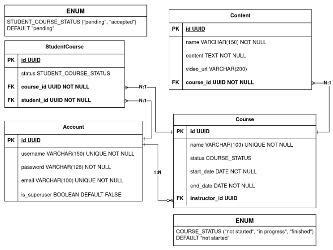

# Kanvas

O projeto se trata de uma API Rest desenvolvida com Python e Django, com o objetivo de facilitar o gerenciamento de alunos, cursos e aulas de uma escola de modalidade EAD.

## Link para documentação:

</br>

https://kanvas-api.onrender.com/api/docs

## Link para deploy:

</br>

https://kanvas-api.onrender.com/api/

### Tecnologias utilizadas:

- Python;
- Django;
- Django rest framework;
- DjangoORM;
- Djangorestframework-simplejwt;
- Pytest;
- PostgreSQL;
- Python-dotenv;

### Diagrama de entidades e relacionamentos

</br>
<div align="center">
  
</div>

#### Rodando os testes

1. Instale as bibliotecas necessárias:

```shell
pip install -r requirements.txt
```

2. Para rodar a bateria de todos os testes, utilize:
```shell
pytest --testdox -vvs
```
